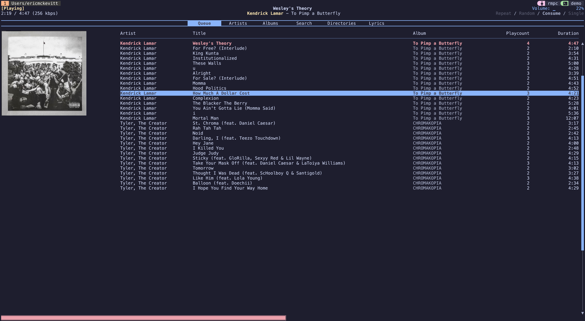
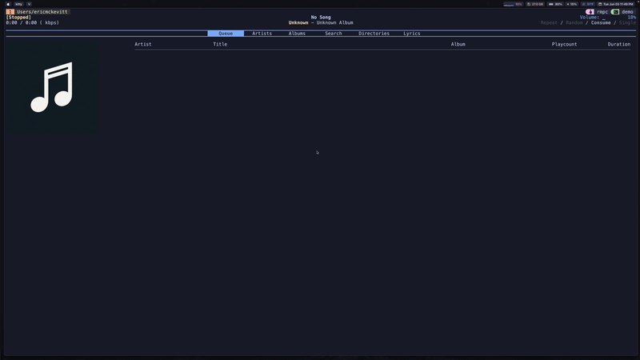
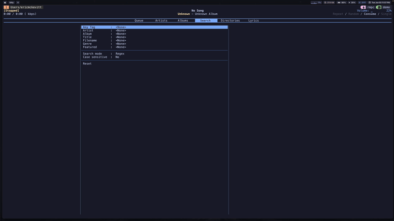
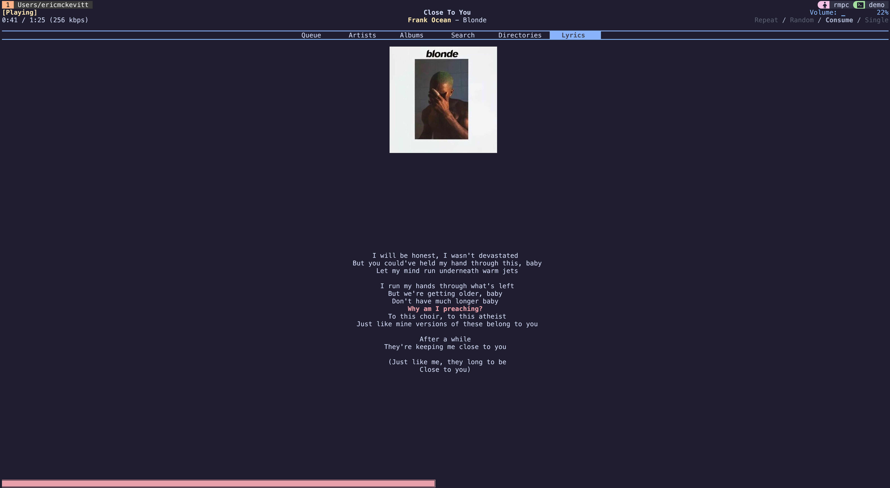

# RMPC Configuration

## 🧠 Overview
This is my personal configuration for rmpc, a command-line client for MPD (Music Player Daemon). It includes custom scripts and MPD settings optimized for a local music library.

<div align="center">
  <br>
  <em>A snapshot of the rmpc interface showing the currently playing track.</em>
</div>

## 📂 Directory Structure
```
.
├── config.ron                  # Main rmpc configuration
├── increment_play_count        # Script to track song plays
├── notify                      # Script to send track notifications on song change
├── README.md
└── themes/
    └── catppuccin_mocha.ron    # Theme file (RON format)
```

## ⚙️ Setup
1.	Dependencies
    - rmpc (https://mierak.github.io/rmpc/next/overview/)
    - mpd (https://mpd.readthedocs.io/en/latest/mpd.conf.5.html)
        - Some setup may be required to get mpd up and running, but there are plenty of tutorials available, and the process is relatively simple. 
    - any terminal notifier if you use the notify script
2.	Installation
    - Follow rmpc install directions on their website
    - Copy config.ron contents to your config file (e.g., `~/.config/rmpc/config.ron`)
    - Copy over theme or create your own
    - Make scripts executable by running `chmod +x increment_play_count notify`
3. Set up a music directory to store your mp3 files. My config assumes `~/Music/mpd/` is the base directory for rmpc. Within `~/Music/mpd/`, each artist is given a folder containing folders for each of their albums (i.e., `~/Music/mpd/Daft Punk/Discovery/` is the path to a series of mp3's for the album Discovery by Daft Punk). 

## 🎬 Demo

<div align="center">
  
  <p><em>Adding to Queue</em></p>
  <p>A demonstration of how tracks can be quickly added to the play queue using the rmpc interface.</p>
</div>

<br>

<div align="center">
  
  <p><em>Search Demo</em></p>
  <p>Using fuzzy search to find artists and albums instantly within a large local library. Assuming .mp3 files are tagged with metadata, you can create advanced searches based on artist, genre, features, etc., using regular expressions.</p>
</div>

# Utilities For Adding Music & Metadata

I have a music directory that rmpc pulls from located at `~/Music/mpd/`, so much of the setup will depend on this assummption, but feel free to adjust to your setup. 

## `utils/tag_music.sh`

I have the `tag_music.sh` script located in my `~/Music/` directory. This script adds standardized ID3 metadata (artist, album, track title, and track number) to each .mp3 file in an album folder using the eyeD3 tool. To use: 
- Set value for `ARTIST` variable
- Set value for `ALBUM` variable
- Set value for `DIR` variable, representing the path to the mp3 files for that album
- Fill in the `TRACKS` array with the names of the album's tracks (matching the mp3 filenames) in track-order.
- Run with `./tag_music.sh` from the same directory the script is in and ensure all tracks were found and tagged. 

## Adding Other Metadata

### Recording Date
To add the album's recording date, which rmpc will use to sort the albums, use one of the following commands (after replacing with the correct date) when in the album's directory: 
- `eyed3 --recording-date=2021 *.mp3`
- `eyeD3 --recording-date=2025-01-31 *.mp3`

### Features
I use the `albumartist` tag (separate from the `artist` tag) to denote the artists who are featured on the album. To speed up the process of tagging features, I include the features in the track name using the following format (`"<song_title> (feat. <featured_artist>).mp3"`) and then run the following command from the album directory: 

```bash
for f in *.mp3; do
  if [[ "$f" =~ "\(feat\. ([^)]+)\)" ]]; then
    FEATURED="${match[1]}"
    echo "Setting album artist to '$FEATURED' for: $f"
    eyeD3 --album-artist "$FEATURED" "$f"
  fi
done
```

### Album Art
To add the album art to rmpc, make sure the album art is stored in the album directory and then run the following command (substituting in the name of the image file). 
```bash
for f in *.mp3; do
  eyeD3 --add-image=cover.png:FRONT_COVER "$f"
done
```

## Adding Genres with `utils/tag_genres.sh`
You can use the script `utils/tag_genres.sh` to add genre tags to each track in an album. Simply navigate to the script and run it as `./tag_genres.sh <path_to_album_directory>`. Then, as you are prompted for each track, enter the genres that describe the track as a list. My preference is to use semicolons as delimiters.

## Adding Lyrics with `utils/fetch_album_lyrics.sh`
You can download `.lrc` files, and rmpc will display synchronized scrolling lyrics in the Lyrics pane. Use the script `utils/fetch_album_lyrics.sh` to automatically fetch `.lrc` files from [LRCLIB](https://lrclib.net/) for all mp3 files in the album directory. 
- Usage: `./fetch_album_lyrics.sh <path_to_album_directory>`

<div align="center">
  <br>
  <em>The rmpc synchronized scrolling lyrics in the Lyrics pane.</em>
</div>
